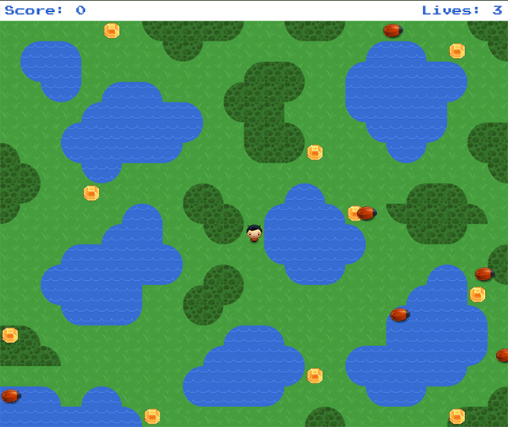

#Udacity Project 2
Arcade demo for the Front-End Developer Nanodegree Program

##Objective
Move the player around the screen using the arrow keys and collect all the gems. Avoid the bugs and the water.

[Live demo](http://rewfergu.github.io/frontend-nanodegree-arcade-game/)
